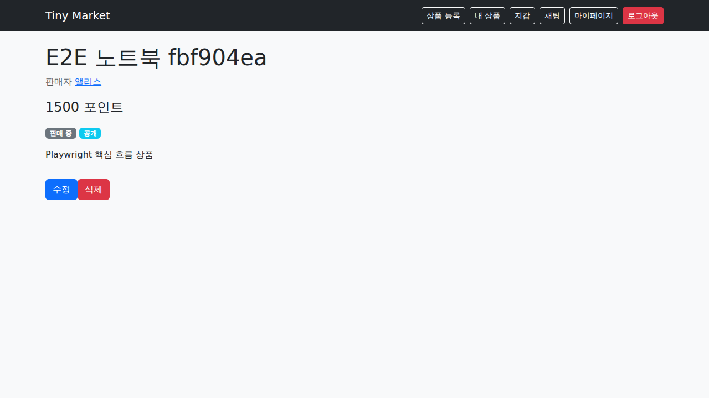
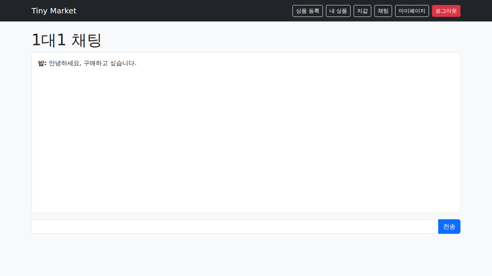
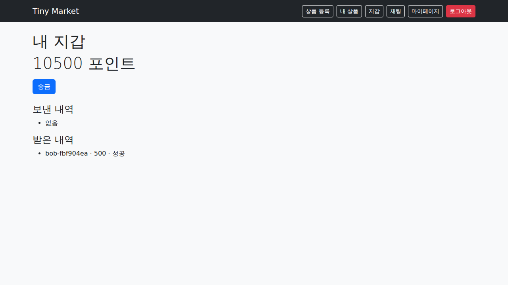
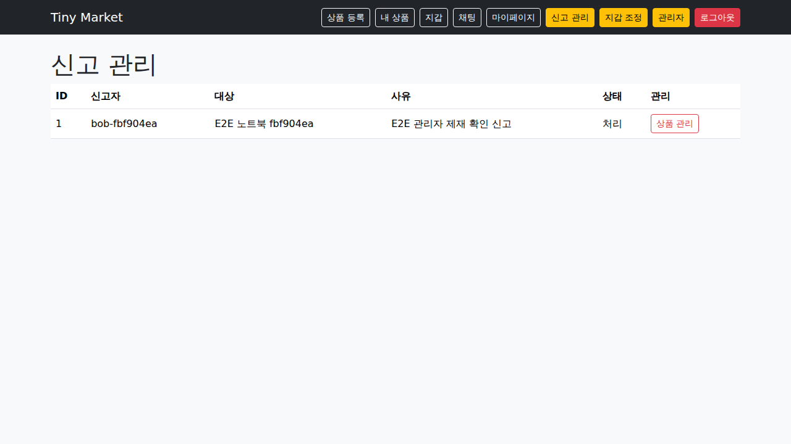

# Tiny Second-hand Shopping Platform

[](https://github.com/choi95411/secure-coding/actions/workflows/ci.yml)

WhiteHat School 시큐어 코딩 과제를 위한 교육용 중고거래 플랫폼입니다. 실제 화폐나 외부 결제를 사용하지 않고 플랫폼 내부 테스트 포인트만 사용합니다.

## 주요 기능

- 회원가입, 로그인·로그아웃, 프로필·마이페이지, 계정 상태 제어
- 상품 등록·조회·수정·소프트 삭제, 검증된 이미지 업로드
- 제목·설명 검색, 판매 상태 필터, 정렬, 페이지네이션
- 사용자별 지갑, 멱등 송금, 불변 복식 원장, 관리자 조정 거래
- 사용자·상품 신고, 자동/수동 제재, 복구, 불변 관리자 감사 로그
- 세션 인증 전체 채팅과 정확한 참여자만 접근하는 1대1 WebSocket 채팅
- Django Admin과 전용 관리 화면을 통한 사용자·상품·신고·메시지·송금 관리

## 기술 스택과 구조

Django 5.2 LTS 서버 렌더링 모놀리스, PostgreSQL 17, Redis/Channels, Bootstrap, Daphne, pytest, Playwright, Docker Compose, GitHub Actions를 사용합니다.

```text
Browser ── HTTP/CSRF ──> Django views/forms ──> services/ORM ──> PostgreSQL
        └─ WebSocket ──> Channels/ASGI ───────> Redis channel layer
                                            └─> persisted Message records
Administrator ── staff authorization ──> moderation/adjustment/audit services
```

업무 데이터의 원본은 PostgreSQL입니다. Redis는 실시간 메시지 전달에만 사용합니다. 모든 소유권·대화 참여자·계정 상태·관리자 권한은 서버에서 다시 검사합니다.

## 요구 환경

- Docker Desktop 또는 Docker Engine + Compose 플러그인
- 비 Docker 실행: Python 3.13, PostgreSQL 17, Redis 7 이상
- GitHub Actions E2E: Playwright Chromium

## 환경변수

`.env.example`을 `.env`로 복사한 뒤 최소한 비밀 키와 DB 비밀번호를 변경합니다. `.env`는 Git에서 제외됩니다.

| 변수 | 설명 | 개발 기본 예시 |
|---|---|---|
| `DJANGO_SECRET_KEY` | Django 서명 비밀 키 | 반드시 변경 |
| `DJANGO_DEBUG` | 디버그 모드 | 로컬만 `true` |
| `DJANGO_ALLOWED_HOSTS` | 허용 Host 목록 | `localhost,127.0.0.1` |
| `DATABASE_URL` | PostgreSQL 연결 문자열 | Compose의 `db` 사용 |
| `REDIS_URL` | Channels Redis 연결 | Compose의 `redis` 사용 |
| `INITIAL_WALLET_POINTS` | 가입 시 테스트 포인트 | `10000` |
| `REPORT_BLOCK_THRESHOLD` | 자동 제재 신고 임계치 | `3` |
| `CHAT_MESSAGES_PER_MINUTE` | 사용자별 채팅 제한 | `20` |
| `LOGIN_MAX_FAILURES` | 로그인 실패 임계치 | `5` |
| `LOGIN_FAILURE_WINDOW_SECONDS` | 실패 집계 창 | `300` |
| `LOGIN_LOCK_SECONDS` | 로그인 잠금 시간 | `900` |
| `SECURE_SSL_REDIRECT` / `SECURE_HSTS_SECONDS` | HTTPS 운영 설정 | 로컬에서는 비활성 |

## Docker 실행

```bash
cp .env.example .env
# .env의 DJANGO_SECRET_KEY, POSTGRES_PASSWORD, DATABASE_URL 비밀번호 변경
docker compose up --build
```

서비스가 준비되면 `http://localhost:8000`에 접속합니다. 관리자 계정은 다음과 같이 생성합니다.

```bash
docker compose exec web python manage.py createsuperuser
```

종료와 로그 확인:

```bash
docker compose logs -f web
docker compose down
```

DB 볼륨까지 삭제하는 `docker compose down -v`는 테스트 데이터를 제거하므로 필요한 경우에만 사용합니다.

## 비 Docker 실행

```bash
python3 -m venv .venv
.venv/bin/pip install -r requirements-dev.txt
cp .env.example .env
# .env의 DATABASE_URL은 localhost PostgreSQL, REDIS_URL은 localhost Redis로 변경
.venv/bin/python manage.py migrate
.venv/bin/python manage.py createsuperuser
.venv/bin/python manage.py runserver
```

SQLite는 단위 개발용 fallback입니다. 송금 동시성 검증과 실제 실행은 PostgreSQL을 사용해야 합니다. 신규 사용자는 가입 시 기본 10,000 테스트 포인트를 받고, 지갑 잔액은 관리자 직접 덮어쓰기가 아니라 감사되는 조정 거래로만 변경합니다.

## 테스트 데이터

두 일반 사용자를 회원가입 화면에서 생성하면 각 사용자에게 프로필과 테스트 지갑이 자동 생성됩니다. 관리자는 `createsuperuser`로 만듭니다. 테스트 DB는 pytest가 자동 생성·정리하며 운영 DB를 사용하지 않습니다.

## 테스트·린트·보안 검사

```bash
.venv/bin/pytest
.venv/bin/ruff check .
.venv/bin/ruff format --check .
.venv/bin/bandit -q -c pyproject.toml -r config users products wallets moderation adjustments chat security_controls
.venv/bin/pip check
.venv/bin/pip-audit -r requirements.txt
DJANGO_DEBUG=false DJANGO_SECRET_KEY='replace-with-a-long-random-test-key' \
  SECURE_SSL_REDIRECT=true SECURE_HSTS_SECONDS=31536000 \
  .venv/bin/python manage.py check --deploy
```

PostgreSQL 동시성과 Redis 채널 계층 테스트는 명시적으로 활성화합니다.

```bash
RUN_POSTGRES_TESTS=1 DATABASE_URL='postgresql://…' \
  .venv/bin/pytest wallets/tests/test_postgres_concurrency.py
RUN_REDIS_TESTS=1 REDIS_URL='redis://127.0.0.1:6379/0' \
  .venv/bin/pytest chat/tests/test_redis_integration.py
```

GitHub Actions는 PostgreSQL·Redis 서비스에서 전체 테스트와 두 외부 통합 테스트를 실행한 뒤 Playwright로 가입 → 상품 → 검색 → 1대1 채팅 → 송금·원장 → 신고 → 관리자 제재 → 일반 사용자 관리자 차단 흐름을 검증합니다.

## 주요 화면 예시

아래 이미지는 GitHub Actions Playwright 핵심 흐름에서 생성하고 시각 검증한 실제 화면입니다. 각 성공 실행의 `e2e-evidence` 아티팩트에도 원본과 Daphne 로그가 보존됩니다.

### 상품 등록·상세



### 사용자 간 1대1 실시간 채팅



### 송금 후 잔액과 거래 내역



### 신고 확인과 관리자 제재



## 보안 설계

Django ORM 바인딩, CSRF, 세션 회전, HttpOnly/SameSite 쿠키, autoescape와 DOM `textContent`, UUID 업로드 경로와 확장자·MIME·크기·이미지 내용 검증을 사용합니다. 송금은 단일 DB 트랜잭션·행 잠금·고유 멱등 키·불변 원장을 사용합니다. 로그인 실패 키는 username/IP 원문 대신 HMAC을 저장하고, WebSocket은 Origin·세션·활성 상태·대화 참여자를 연결 및 이벤트마다 검사합니다.

상세 문서:

- `docs/requirements.md`: 요구사항·구현·테스트 추적표
- `docs/architecture.md`, `docs/database-design.md`, `docs/api-design.md`
- `docs/threat-model.md`, `docs/security-checklist.md`
- `docs/test-plan.md`, `docs/maintenance-log.md`, `docs/progress.md`
- `docs/submission-checklist.md`: 보고서를 제외한 제출 준비 상태

## 알려진 제한사항

- 교육용 내부 포인트이며 외부 결제·실물 화폐·추천 시스템을 지원하지 않습니다.
- 로컬 Codex 브라우저 런타임 오류 때문에 브라우저 E2E는 GitHub Actions에서 수행합니다.
- 운영 배포 서비스는 범위 밖이며 로컬 Docker와 GitHub Actions까지만 지원합니다.
- 최종 보고서 작성과 PDF 시각 검증은 사용자의 이번 요청에 따라 제외했습니다.
